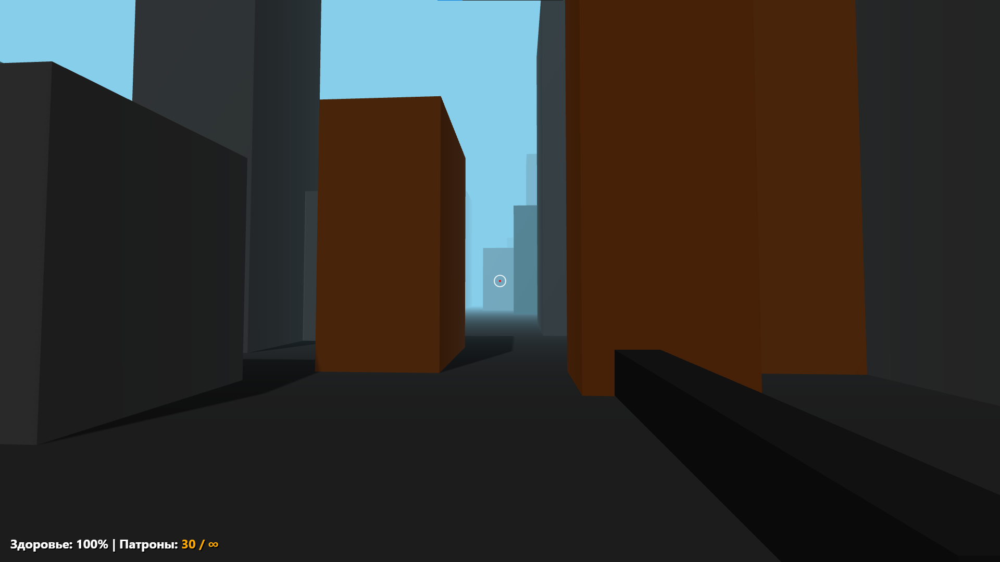
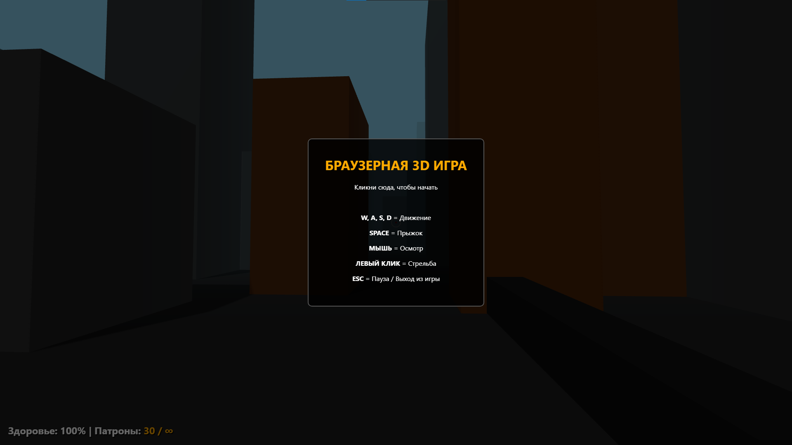
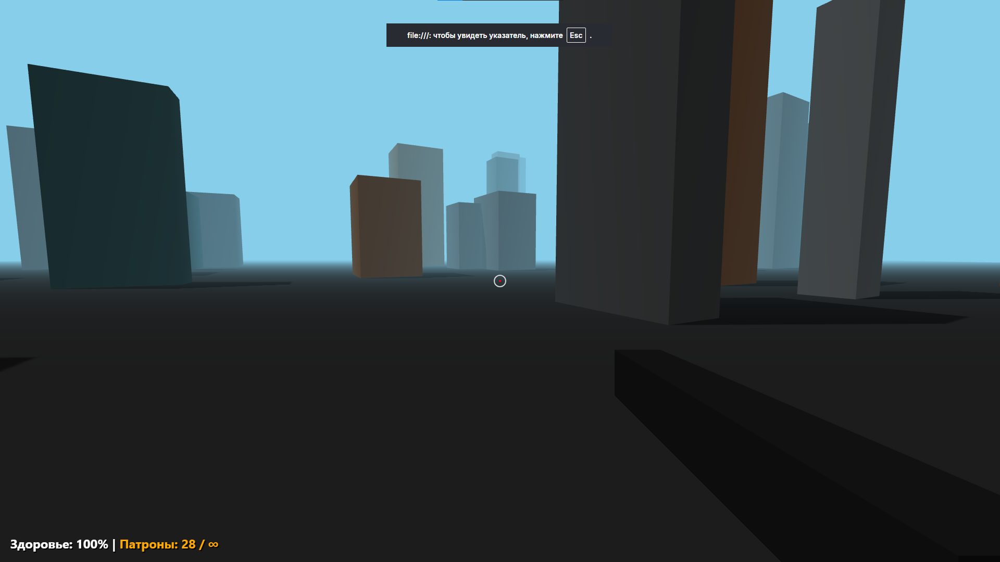
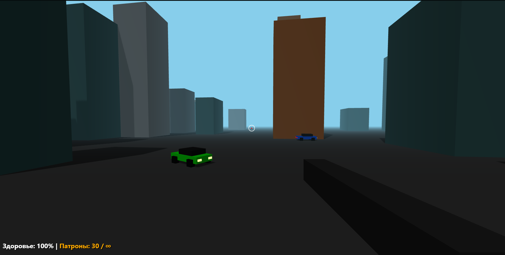
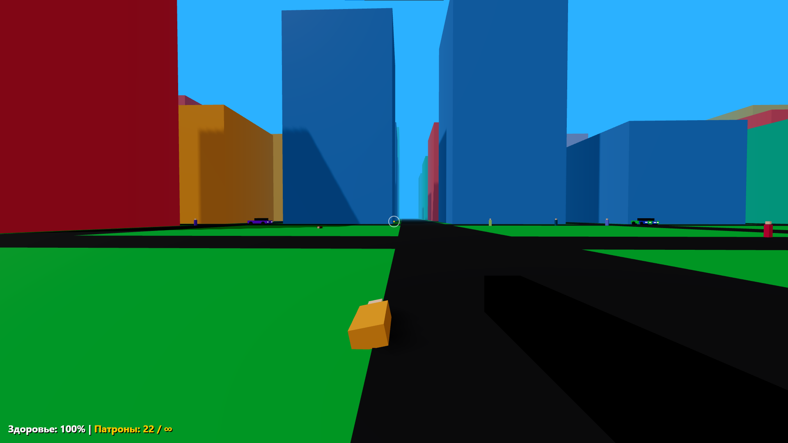
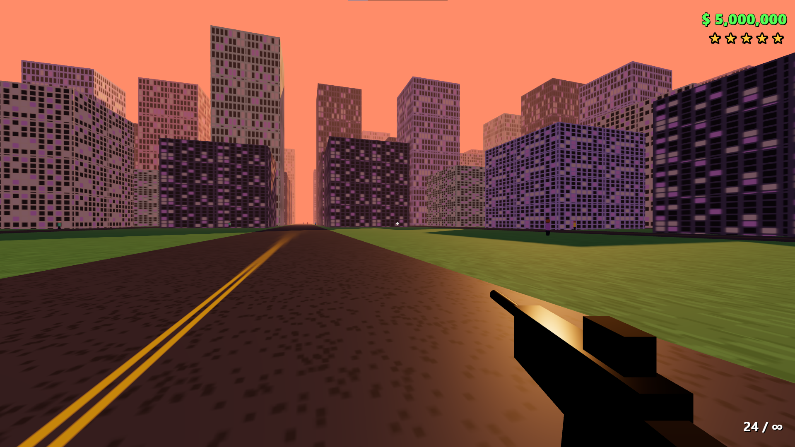
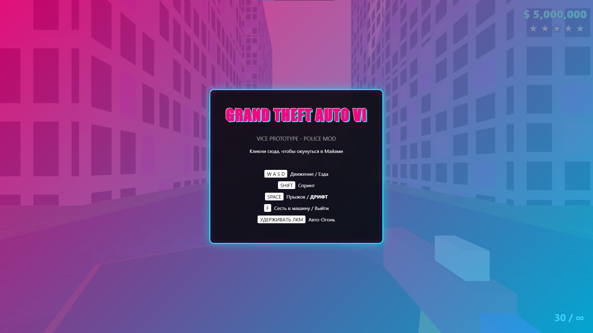
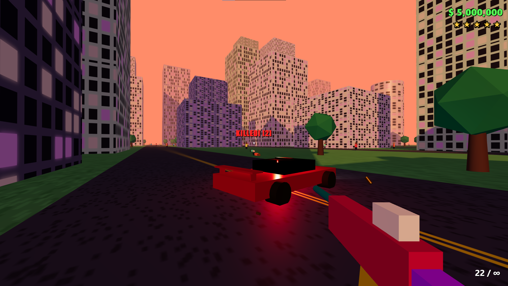

# Отчёт по интеграциям и заданиям

---

## Задание 1. Текстовое описание прототипа

Полное техническое описание находится в файле [`technical_spec.md`](technical_spec.md).

**Краткое резюме:** браузерная 3D-игра «GTA VI Web Prototype» с процедурным городом, 180 NPC с ИИ-поведением, 15 автомобилями, системой стрельбы через Raycasting и Miami Vice-визуальным стилем. Единый HTML-файл, Three.js 0.158.0.

---

## Задание 2. Генерация прототипа с помощью ИИ-агента

Прототип сгенерирован агентом **Claude (claude-sonnet-4-20250514, Anthropic)** на основе технического описания из Задания 1.

**Результат:** файл `game_ai.html` — 1173 строки кода, полностью рабочий, без серверной части.

---

## Задание 3. Процесс взаимодействия с ИИ-агентом

### Итерация 1 — Базовая сцена + управление + образ оружия

**Запрос:**
```
Создай HTML-файл с Three.js сценой. Добавь процедурный город: сетка дорог 50×50, 
здания случайной высоты. Управление от первого лица — WASD + мышь 
(PointerLockControls). Захват курсора по клику. Образ оружия.
```
**Результат:** базовая сцена с освещением, плоскостью земли, сеткой зданий и рабочим управлением. Добавлен начальный образ оружия от первого лица. Стартовый экран с инструкцией управления.

На скриншоте ниже — стартовый экран первой итерации с базовым HUD (здоровье и патроны):



На втором скриншоте — вид от первого лица с базовой геометрией города (здания без текстур, синее небо):



---

### Итерация 2 — Текстуры, архитектура, исправление зданий

**Запрос:**
```
Исправь генерацию зданий — они не должны пересекаться с дорогами. Добавь процедурные 
текстуры через Canvas API: асфальт, фасады.
```
**Результат:** функция `createCanvasTexture()`, корректная расстановка объектов. Здания теперь размещаются строго в блоках, дороги отрисованы с тёмным асфальтом. Добавлен туман для ощущения глубины.

На скриншоте — улучшенная геометрия города с туманом и корректным расположением зданий:



---

### Итерация 3 — ИИ пешеходов + образы машин

**Запрос:**
```
Добавь 180 NPC. Каждый патрулирует по случайным waypoints. При приближении игрока 
на 8 единиц NPC переходит в режим паники и убегает со скоростью ×3.5. Реализуй 
анимацию ходьбы через изменение rotation.
Добавь образы машин.
```
**Результат:** массив `npcs[]`, машина состояний `walk/panic`, функция `updateNPCs(delta)`. На дорогах появились первые образы автомобилей с фарами.  
**Оптимизация агента:** вместо отдельного Raycaster на каждый NPC — `position.distanceTo()`.

На скриншоте видны автомобили на дорогах и первые NPC-пешеходы:



---

### Итерация 4 — Транспорт с физикой + трава + насыщенная цветовая схема

**Запрос:**
```
Добавь 15 автомобилей на дорогах. Функция createCar() с геометрией кузова, крыши, 
колёс. По клавише F — вход/выход. В режиме вождения: W/S газ/тормоз, A/D руль, 
ПРОБЕЛ дрифт. Камера следует за машиной.
Добавь траву.
Сделай цветовую схему более насыщенной.
```
**Результат:** объект `car` с физикой инерции, покрытие дороги стало более тёмным, здания получили яркие цвета, трава стала насыщенной зелёной.  
**Баг:** при выходе из машины игрок телепортировался в `(0,0,0)`.  
**Фикс-запрос:** `«Исправь выход из машины — игрок должен появляться рядом с дверью»`  
**Исправление:** `car.mesh.position.clone().add(offset)`

На скриншоте — насыщенная цветовая схема: яркие здания, зелёная трава, тёмный асфальт:



---

### Итерация 5 — Оружие + HUD + деревья + закат + окна в зданиях + полосы движения

**Запрос:**
```
Добавь оружие FPS-вида из BoxGeometry (приклад, ствол, магазин, прицел). Стрельба — 
удержание ЛКМ, автоогонь каждые 100мс. Raycaster от центра камеры. При попадании 
в NPC — убить. При попадании в объекты — искры + отверстие. HUD: деньги, розыск 
5 звёзд, патроны, прицел.
Добавь деревья (цилиндр + икосаэдр) в пустых блоках.
Добавь закат, улучши здания (окна добавь), полосы движения на дорогах.
```
**Результат:** `THREE.Raycaster`, система частиц (искры, гильзы, кровь), HTML HUD с деньгами и уровнем розыска. Здания получили текстуру окон, на дорогах появились жёлтые полосы разметки. Небо стало закатным (оранжево-розовым). Появились деревья. Оружие — чёрный матовый пистолет.

На скриншоте — финальный вид пятой итерации с закатом, окнами в зданиях, HUD и оружием:



---

### Итерация 6 — Miami Vice-стиль + полицейские мигалки + сбивание NPC + оптимизация

**Запрос:**
```
Добавь неоновую схему Miami Vice (розовый фон неба, cyan/magenta акценты). Добавь дым. 
Оптимизируй: уменьши cityRadius до 200, тени только для DirectionalLight.
Разукрась оружие, добавь на машины полицейские мигалки, сделай возможность сбивать NPC 
на машине, добавь деревья.
```
**Результат:** туман `THREE.FogExp2`, настроены тени, оружие стало ярким неоновым (розовый корпус, бирюзовый ствол), на машинах появились красно-синие полицейские мигалки (PointLight, 15 миганий/с), реализовано сбивание NPC колёсами автомобиля.

Финальный вид игры — стартовый экран с Miami Vice-эстетикой и полным HUD:



Финальный вид во время геймплея — неоновое оружие, NPC, счётчик убийств:



---

### Итоговая таблица итераций

| № | Запрос | Ключевой результат | Статус |
|---|--------|--------------------|--------|
| 1 | Базовая сцена + управление + образ оружия | PointerLockControls, город, стартовый экран | ✅ |
| 2 | Исправление зданий + текстуры Canvas API | Корректный город, асфальт, фасады, туман | ✅ |
| 3 | NPC walk/panic AI + образы машин | 180 NPC, машина состояний, авто на дорогах | ✅ |
| 4 | Транспорт + физика + трава + цвета | 15 авто, дрифт, фикс телепорта, насыщенные цвета | ✅ |
| 5 | Оружие + Raycaster + HUD + закат + окна + полосы | Стрельба, частицы, интерфейс, деревья | ✅ |
| 6 | Miami Vice + мигалки + сбивание NPC + оптимизация | Неон, полицейские авто, 60 FPS | ✅ |


---

## Заключение

Все задачи лабораторной работы выполнены. Создан рабочий прототип браузерной 3D-игры (1173 строки) с 8 игровыми системами за 6 итераций взаимодействия с ИИ-агентом Claude. Освоены навыки составления технических описаний для ИИ-агентов, работы с Git (init/add/commit/push) и публикации кода на GitHub.
